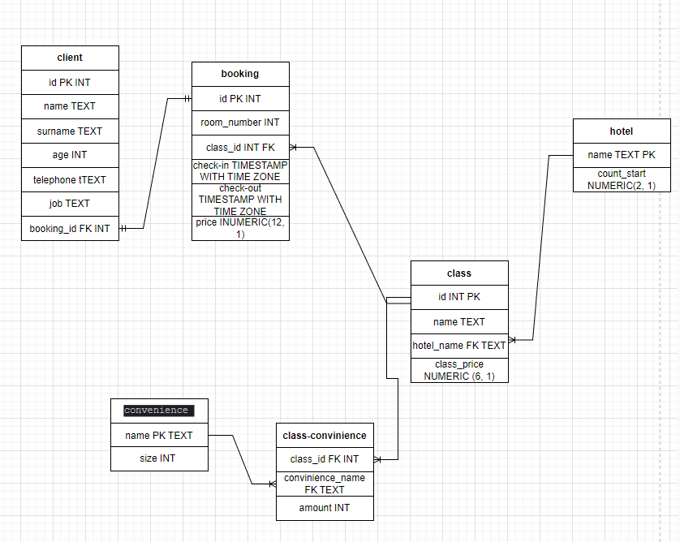

# This is project of admin panel travelling

## Schema database 



---

**Стэк**:


[](https://www.sqlalchemy.org/)


---

## Как развернуть проект локально

Склонировать репозиторий:
```
git clone https://github.com/toth3m00n/admin-panel-travelling
```
Установить и активировать виртуальное окружение:
```
cd computer_club
python -m venv venv
source venv/bin/activate
(source venv/Scripts/activate - на Windows)
```
Установить необходимые зависимости:
```
pip install -r requirements.txt
```
Перейти в рабочую папку:
```
cd admin-panel-travelling
```

*Примечание:*
*Перед работой у вас должна быть создана база данных и файл .env*
*Пример файла `.env`:*
```
KEY=smth
DATABASE_URL=postgresql://[user[:password]@][netloc][:port][/dbname]
APP_SETTINGS=config.DevelopmentConfig
PASSWORD=your_db_password
```

Теперь можно запускать проект:
```
python manage.py runserver
```

Заполнить базу данных, если требуется. Данные для моего прилождения можно найти в [data for db](https://github.com/toth3m00n/admin-panel-travelling/blob/main/app/table/data_for_db.py) :
```
python table_fil.py
```
